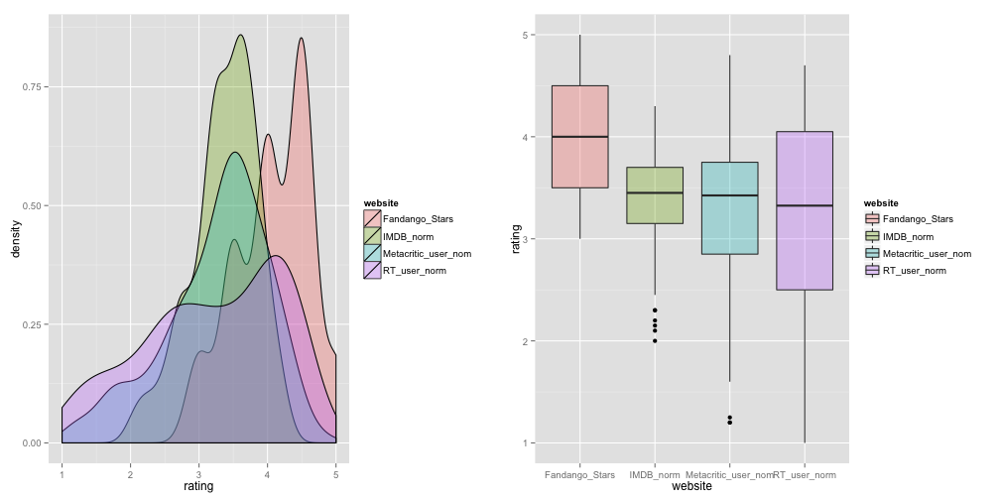

## Project Overview

1. Online movie review has become a serious catalyst for the movie industry. 

2. Among all the online movie review website, Rotten Tomato, IMDB, Metacritic and Fandango, who should you trust?

3. Fandango is different from other reviewer, because they are in the movie ticket business. Would their rating differ significantly from other movie rating website?

I always purchase ticket on the Fandango App on my phone, and their ratings in stars has become an important tie breaker for me to decide which movie to watch. But I always had this feeling that some mediocre movies get handsomely rated. After reading [this great article](http://fivethirtyeight.com/features/fandango-movies-ratings/) on [FiveThirtyEight](http://fivethirtyeight.com), I decided to take their [data](https://github.com/fivethirtyeight/data/tree/master/fandango) and make it shinier. 

In order to compare ratings from different movie rating website, I made a Shiny App to explore the data. Please find the App here: 

---

## Rating Distribution Overview

Before jumping into the App, let's inspect the distribution of rating from different website. 

It is clear that Fandango's rating has higher mean and less variance. Their "user ratings" seldomly reach lower than 3.5 stars. 

---

## Shiny App Overview

I built a Shiny App to break down this significant difference in detail using a lollipop chart. Below is a small subset of that.

In the Shiny App, user can choose different website rating to compare to Fandango's rating, they can also hover on the movie they are interested to learn more. You will notice that Fandango's ratings are usualy higher than other websites. (Hover over to interact)

<iframe src=' assets/fig/nvd3plot2-1.html ' scrolling='no' frameBorder='0' seamless class='rChart dimple ' id=iframe- chartd8d3f7fb1c2 ></iframe> 

---

## Compare Review Error

The second tab of the App is for users to compare different movie rating based on their rating counts and rating error, which is the difference of specific website's rating and average rating for one specific movie. 

Here users have the option to specify the range of the rating error to explore which movies are overated and underated, also how many users have rated them. (Hover over to interact) It is clear that Fandango's rating are usually above the average and based on smaller population compare to IMDB. 

<iframe src=' assets/fig/unnamed-chunk-2-1.html ' scrolling='no' frameBorder='0' seamless class='rChart dimple ' id=iframe- chartd8d2054e913 ></iframe> 

---

## Conclusion

1. The purpose of this Shiny App is allow users to explore the movie rating data from different movie rating websites visually and formulate their own conclusion. 

2. In order for a movie rating website to be reliable, their ratings have to be consistent and also drawn from a large audience. In this measure, IMDB would be the most reliable rating. (see tab2: Rating Error & Rating Counts) in the Shiny App. 

3. A viewer probably has to be suspicious about Fandango's movie rating, their rating on the website is in a 5 stars system and has [a weird rounding rule](http://fivethirtyeight.com/features/fandango-movies-ratings/). The result is Fandango's ratings are often consistently over generous, especially with really popular mediocre movie, eg. [Fifty Shades of Grey](http://www.fandango.com/fiftyshadesofgrey_165809/movieoverview). 

## About

1. You can find the data and the article that inspired this by clicking on the link. 

2. All the ratings used in the Shiny App and analysis are users rating, instead of critic's rating, which are usually lower. 

3. I will keep updating this Shiny App for more functionalities. 

4. Besides being a lethal [chemist](http://www.ign.com/wikis/plants-vs-zombies-garden-warfare/Chemist) in [Plants vs. Zombies, Garden Warfare](http://www.pvzgardenwarfare.com), I was also a data analyst at [The Marketing Store](http://chi.tmsw.com)'s Insights & Analytics Department. For conversation and collaboration, feel free to reach me on [LinkedIn](https://www.linkedin.com/in/aaronranan) and [Github](https://github.com/AaronRanAn). 

